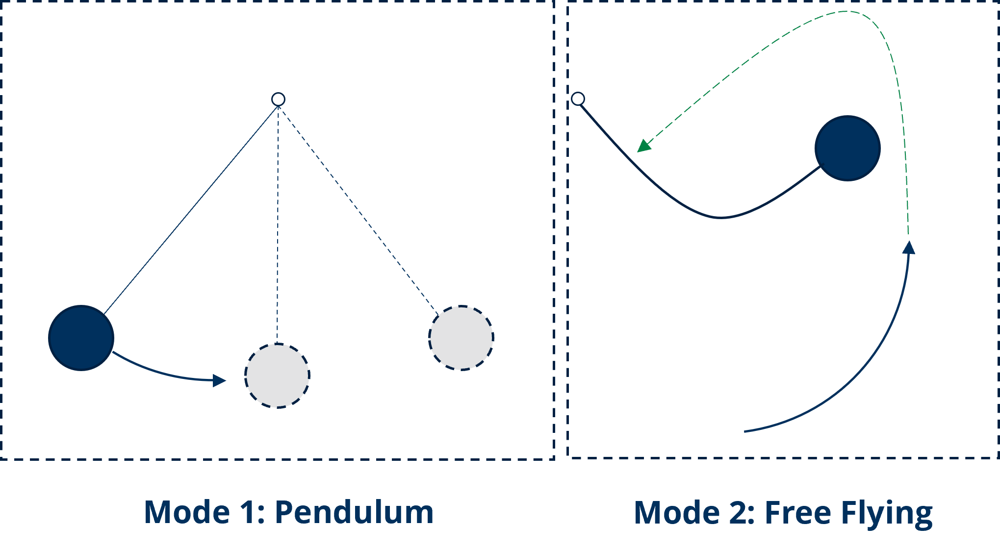
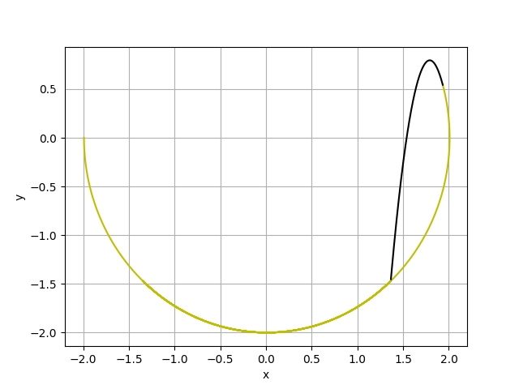

# DySMo

The framework DySMo allows users to create variable-structure Modelica models, which can be simulated in OpenModelica and Dymola.

Original repository by Alexandra Mehlhase: https://github.com/alexa-mehl/DySMo2
PhD Thesis by Alexandra Mehlhase: [Konzepte für die Modellierung und Simulation strukturvariabler Modelle](https://depositonce.tu-berlin.de/items/39d94ae4-e3f8-46f3-ac5d-6bd652acf9ee)
User guide: [UserGuide](https://github.com/alexa-mehl/DySMo2/blob/master/UserGuide/UserGuide.pdf) 

Updated and refactored by Zizhe Wang (zizhe.wang@tu-dresden.de) in 2025.

In the case of a pendulum, the two modes correspond to two model structures. In classical Modelica programs, the simulation will fail, the result of simulating this model with DySMo is shown.

The examples have been updated and tested with the following results:
* `ballSimple`: ✔
* `bouncingBall`: ✔
* `domino`: ❌ model error
* `nailPendulum`: ❌ unbalanced model
* `pendulum`: ✔
* `pipe`: ❌ memory error
* `satellite`: ❌ memory error
* `wagon`: ✔

New examples added:
* `Clutch`
  * Example from: [Benveniste, A., Caillaud, B., Malandain, M., & Thibault, J. (2022). Algorithms for the Structural Analysis of Multimode Modelica Models. *Electronics*, *11*(17), 2755.](https://www.mdpi.com/2079-9292/11/17/2755)